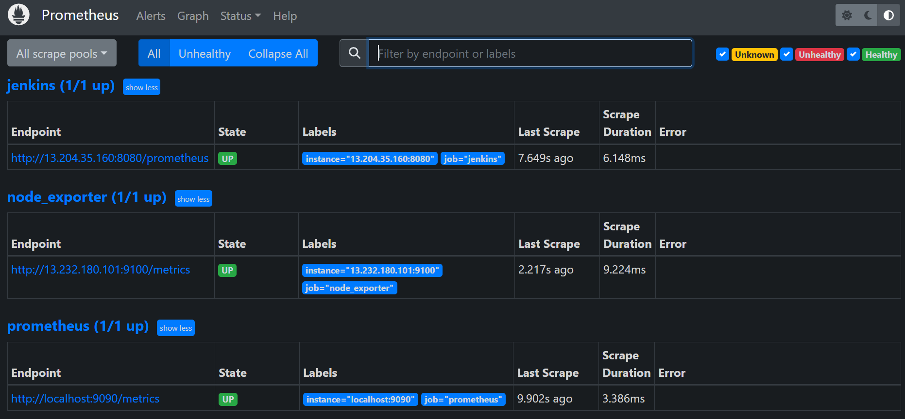
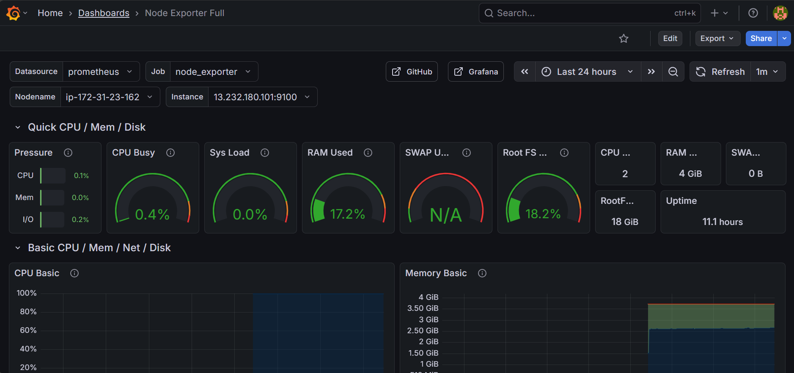
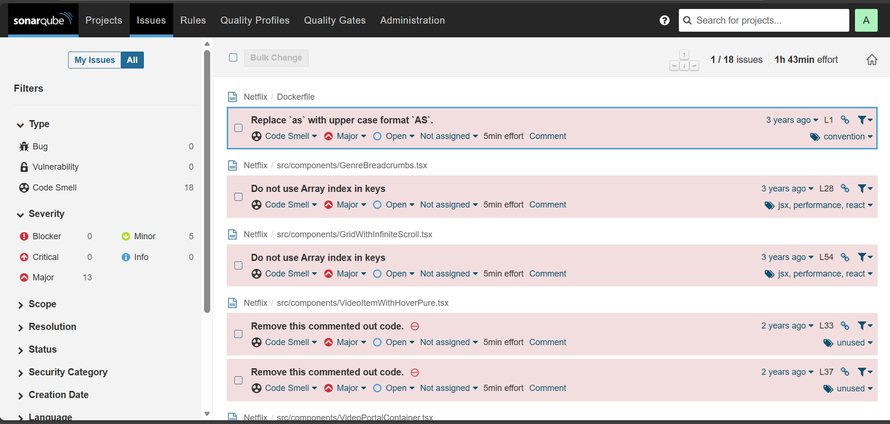
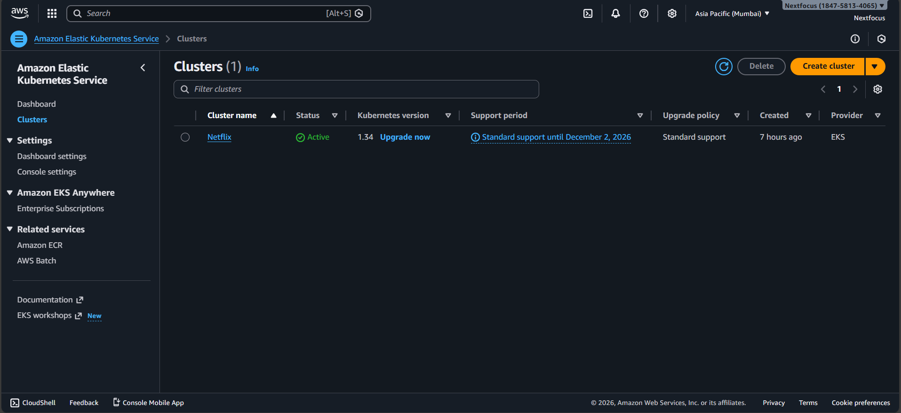
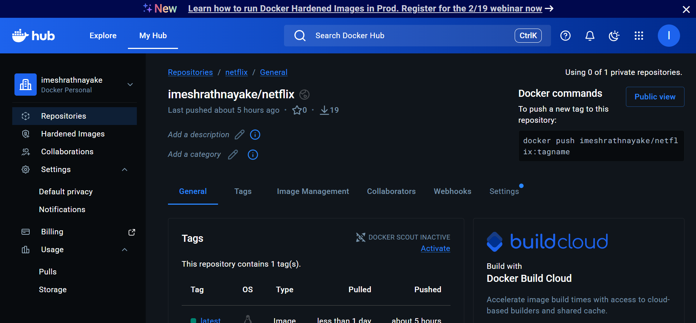
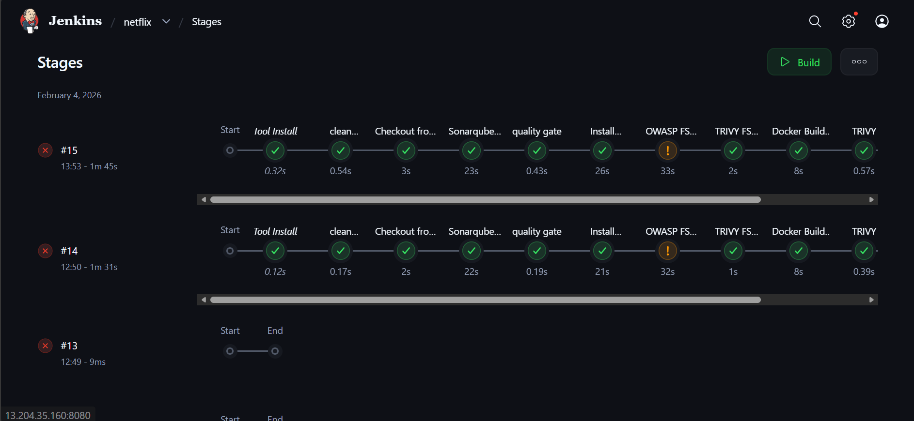

# 🎬 Netflix Clone - DevSecOps Pipeline Project

[](https://vitejs.dev/)
[](https://www.typescriptlang.org/)
[](https://www.docker.com/)
[](https://kubernetes.io/)
[](https://www.jenkins.io/)
[](https://prometheus.io/)

## 📋 Table of Contents
- [Project Overview](#project-overview)
- [Architecture Diagram](#architecture-diagram)
- [Infrastructure Setup](#infrastructure-setup)
- [DevSecOps Pipeline](#devsecops-pipeline)
- [Monitoring & Observability](#monitoring--observability)
- [Security Implementation](#security-implementation)
- [Quick Start Guide](#quick-start-guide)
- [Project Proof & Artifacts](#project-proof--artifacts)

## 🎯 Project Overview

This project demonstrates a complete **end-to-end DevSecOps pipeline** for a Netflix style web application. It integrates security at every phase from code development to production deployment with automated testing, container security scanning, infrastructure as code, and continuous monitoring.

### 🔑 Key Features
- **Multi-stage CI/CD Pipeline** with Jenkins automation
- **Security-First Approach** with SonarQube analysis and vulnerability scanning
- **Container Orchestration** using Amazon EKS (Elastic Kubernetes Service)
- **Real-time Monitoring** with Prometheus and Grafana dashboards
- **Infrastructure as Code** with Docker and Kubernetes manifests

## 🏗️ Architecture Diagram

```
Developer → Git Repository → Jenkins Pipeline → Docker Hub → Amazon EKS → Production
     ↓            ↓              ↓               ↓            ↓            ↓
   Code      Version       Automated        Container    Kubernetes    Netflix
   Push      Control         Build          Registry      Cluster      Application
     ↓            ↓              ↓               ↓            ↓            ↓
           SonarQube       Security Scan    ECR/Push    Deployment    Monitoring
           Analysis       (Trivy, Snyk)                (K8s Manifests) (Prometheus/Grafana)
```

## ⚙️ Infrastructure Setup

### AWS Cloud Infrastructure
- **EC2 Instance**: Jenkins server with automated build capabilities
- **Amazon EKS Cluster**: Managed Kubernetes cluster for container orchestration
- **Security Groups**: Configured network policies for secure communication

### Jenkins CI/CD Server
- **Location**: EC2 instance (`13.204.35.160:8080`)
- **Purpose**: Central automation server for the entire pipeline
- **Configuration**: Multi-stage pipeline with quality gates

### Container Registry
- **Docker Hub Repository**: `imeshrahnayake/netflix`
- **Image Tags**: Latest build pushed approximately 5 hours ago
- **Security**: Automated vulnerability scanning on push

## 🔄 DevSecOps Pipeline

### Pipeline Stages
1. **Code Checkout**: Fetch source code from GitHub repository
2. **Static Analysis**: SonarQube scanning for code quality and security
3. **Build & Test**: Compile TypeScript, run tests, generate artifacts
4. **Security Scanning**: Container vulnerability analysis
5. **Containerization**: Docker image build and optimization
6. **Push to Registry**: Secure upload to Docker Hub
7. **Kubernetes Deployment**: Automated rollout to EKS cluster
8. **Health Verification**: Application and service validation

### Quality Gates
- **SonarQube Quality Gate**: Must pass before proceeding
- **Security Thresholds**: Critical vulnerabilities fail the build
- **Test Coverage**: Minimum 80% code coverage required
- **Build Success**: All stages must complete successfully

## 📊 Monitoring & Observability

### Prometheus Monitoring
- **Targets**: Jenkins, Node Exporter, and self-monitoring
- **Scrape Interval**: Regular health checks every 15 seconds
- **Alerting**: Configured rules for system anomalies


*Prometheus monitoring dashboard showing healthy scrape targets*

### Grafana Visualization
- **CPU Monitoring**: Real-time CPU usage and load averages
- **Memory Tracking**: RAM utilization and swap usage
- **Disk Metrics**: Filesystem usage and I/O performance
- **Uptime Tracking**: System and application availability


*Grafana dashboard displaying system metrics from Node Exporter*

## 🔒 Security Implementation

### Code Security with SonarQube
- **Code Smell Detection**: Identified 18 code quality issues
- **Security Vulnerabilities**: Continuous scanning for potential threats
- **Technical Debt**: Measured and tracked for improvement


*SonarQube dashboard showing code analysis results and issues*

### Container Security
- **Base Image Scanning**: Regular updates for security patches
- **Vulnerability Database**: Updated CVE checks on every build
- **Least Privilege**: Containers run with non-root users

### Infrastructure Security
- **Network Policies**: Restricted pod-to-pod communication
- **Secret Management**: Encrypted environment variables
- **Access Controls**: IAM roles with minimal permissions

## 🚀 Quick Start Guide

### Prerequisites
```bash
# Tools required
- Docker & Docker Compose
- kubectl (Kubernetes CLI)
- AWS CLI (for EKS deployment)
- Node.js 18+ and npm
```

### Local Development
```bash
# Clone the repository
git clone https://github.com/IAU-Rathnayake/DevSecOps-Project-netflix.git
cd DevSecOps-Project-netflix

# Install dependencies
npm install

# Start development server
npm run dev

# Build for production
npm run build
```

### Docker Build
```bash
# Build the Docker image
docker build -t netflix-devsecops:latest .

# Run locally
docker run -p 5173:5173 netflix-devsecops:latest

# Push to Docker Hub
docker tag netflix-devsecops:latest imeshrahnayake/netflix:latest
docker push imeshrahnayake/netflix:latest
```

### Kubernetes Deployment
```bash
# Configure kubectl for EKS
aws eks update-kubeconfig --region ap-south-1 --name Netflix

# Apply Kubernetes manifests
kubectl apply -f kubernetes/

# Check deployment status
kubectl get pods -n netflix
kubectl get services -n netflix
```

## 📸 Project Proof & Artifacts

### Infrastructure Proof

#### AWS EC2 Instance (Jenkins Server)

*Jenkins server running on AWS EC2 instance with public IP for CI/CD pipeline*

#### Amazon EKS Cluster

*Amazon Elastic Kubernetes Service cluster running the Netflix application in production*

#### Docker Hub Repository

*Docker Hub repository containing the built Netflix container images*

### Pipeline Execution Proof

#### Jenkins Pipeline

*Jenkins multi-stage pipeline showing successful builds and execution times*

### Video Demonstration
A complete walkthrough video is available in the `assets` folder, demonstrating:
- Pipeline execution from code commit to deployment
- Real-time monitoring dashboards
- Application functionality and user interface
- Troubleshooting and debugging processes

[Watch the website vedio](assets/website.mp4)

## 🛠️ Troubleshooting Common Issues

| Issue | Solution | Command/Check |
|-------|----------|---------------|
| **Jenkins pipeline failing** | Check Jenkins logs and agent connectivity | `kubectl logs -n jenkins <pod-name>` |
| **EKS pods not starting** | Verify resource limits and node capacity | `kubectl describe pod <pod-name>` |
| **Docker build errors** | Check Dockerfile syntax and build context | `docker build --no-cache -t test .` |
| **Prometheus targets down** | Verify network policies and firewall rules | `kubectl get networkpolicies` |
| **SonarQube quality gate fail** | Review code analysis results | Check SonarQube project dashboard |

## 📈 Future Enhancements

1. **GitOps Implementation**: ArgoCD for declarative Kubernetes deployments
2. **Advanced Security**: Falco for runtime security and intrusion detection
3. **Cost Optimization**: Kubecost for Kubernetes spending insights
4. **Disaster Recovery**: Multi-region EKS cluster deployment
5. **Performance Testing**: Integrated load testing in the pipeline

## 📄 License & Acknowledgments

This project is developed for educational purposes to demonstrate DevSecOps principles in practice. The Netflix UI design is a clone for demonstration only.

**Built by IAU-Rathnayake** as part of a comprehensive DevSecOps learning journey.

---

**⭐ Star this repository if you found it helpful!**

**🔗 Connect with me:** [GitHub](https://github.com/IAU-Rathnayake) | [LinkedIn](https://www.linkedin.com/in/imeshrathnayake/)

*For questions or collaboration opportunities, please open an issue on this repository.*
